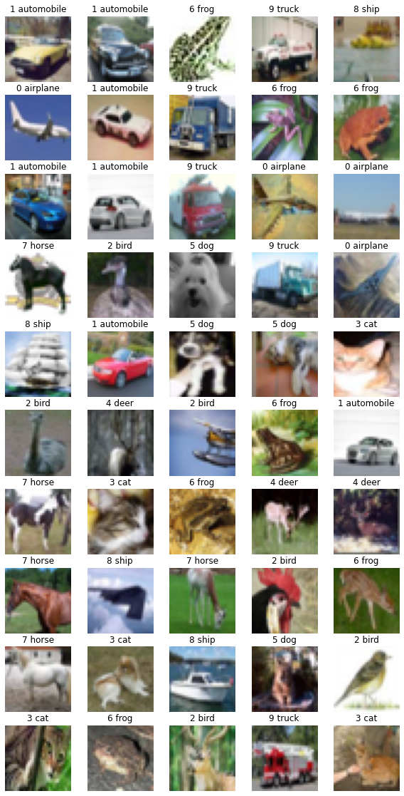
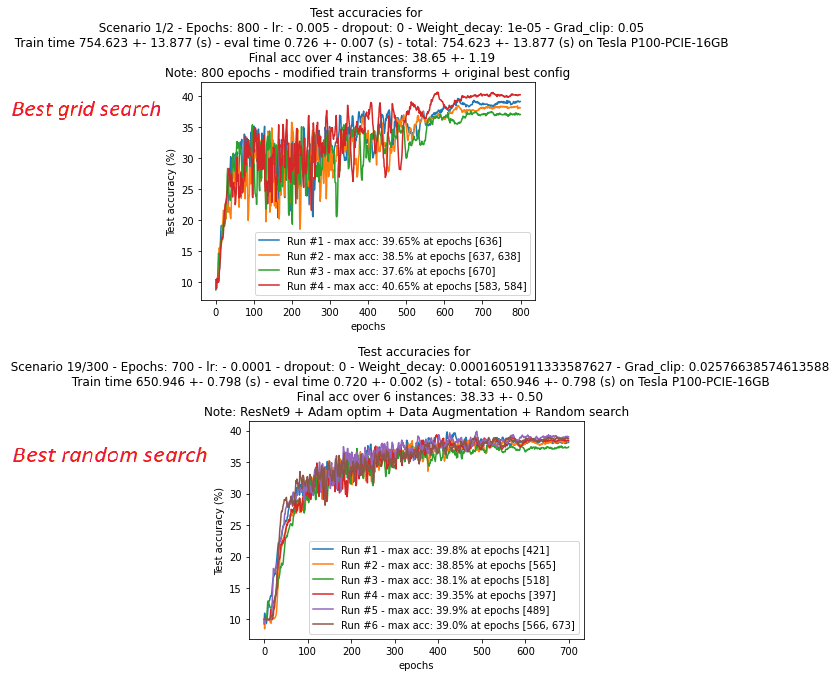
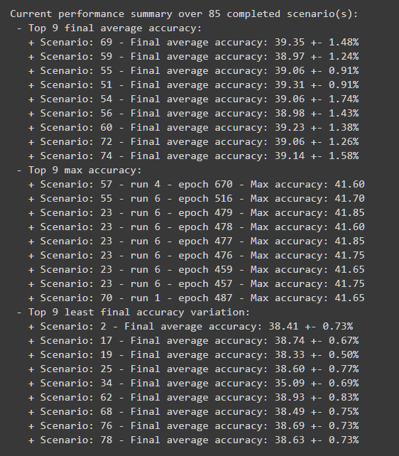
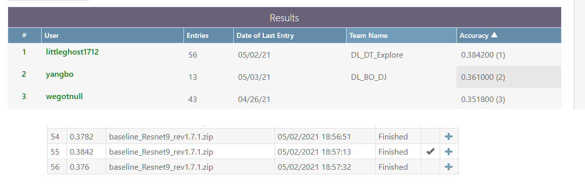
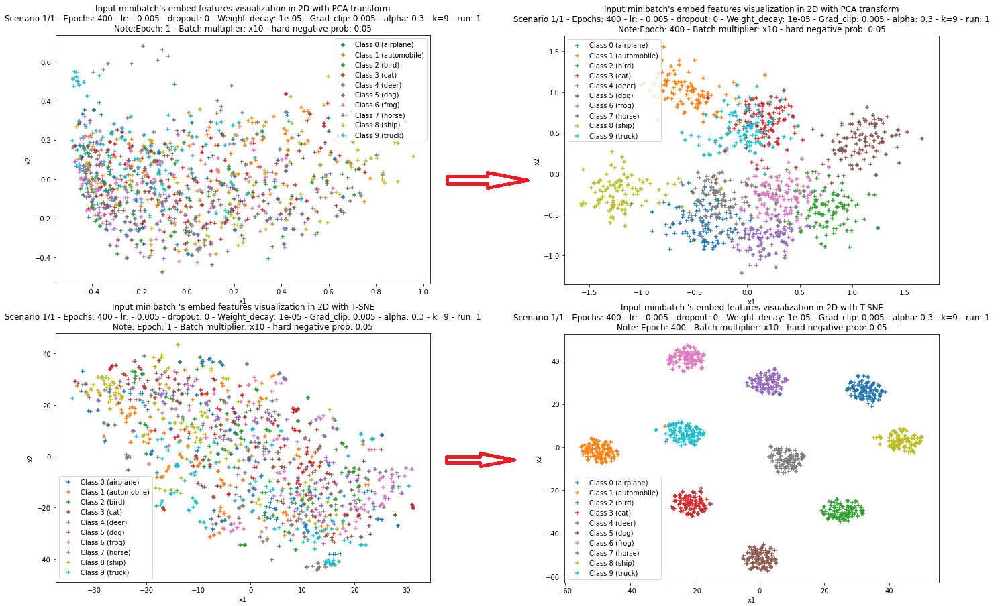
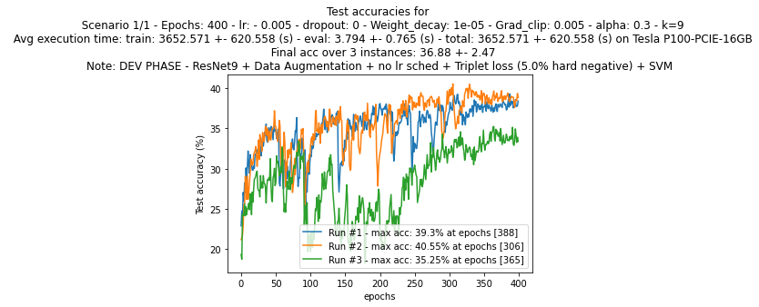
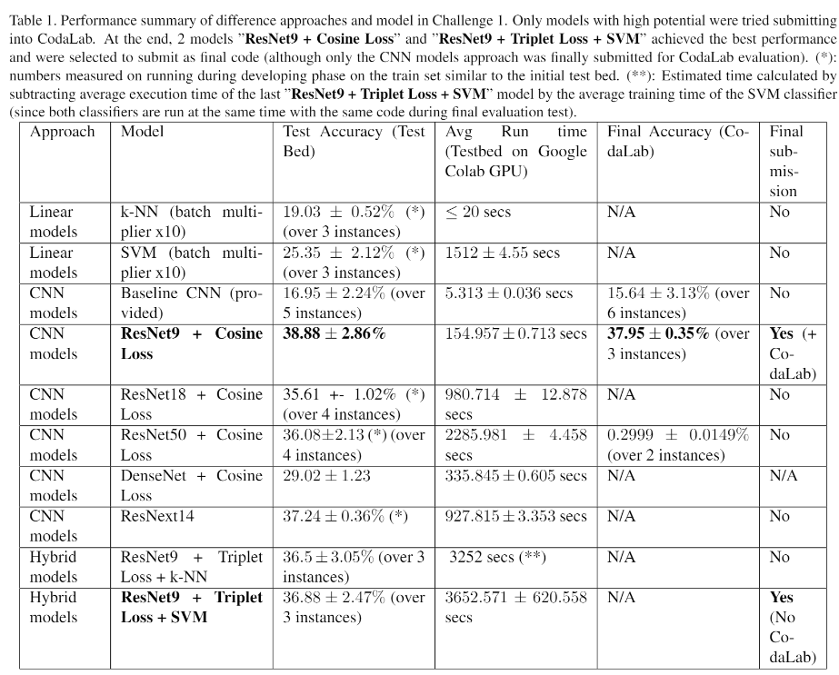
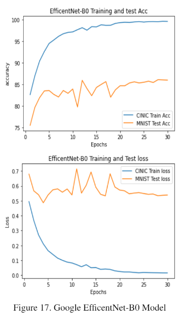
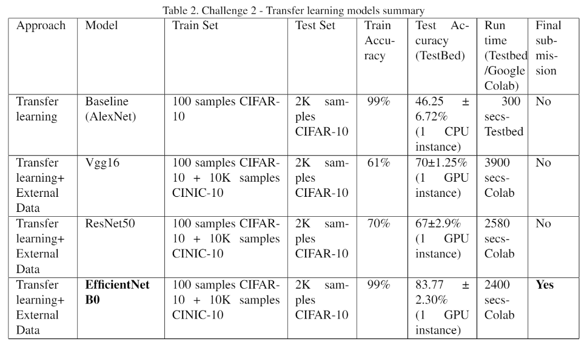

# Deep Learning Project: Learning With Limited Data

# Introduction

Learning with limited data is one of the interesting aspects of Deep Learning (DL) in the Machine Learning (ML) field in general. This project presents a challenge in two different contexts.

## Challenge 1

The challenge is to perform few-sample learning on the CIFAR-10 dataset. The dataset consists of only 100 samples. A larger dataset (e.g. the CIFAR-10 test set) will be used for testing. The task is to train on 100 randomly selected (but class balanced) samples from the CIFAR-10 training set.

### Evaluation

In the final evaluation, the model will be run on 5 random instances of this problem. The evaluation will occur both on the CIFAR-10 test set and other data which will not be revealed at the moment. There is also a CodaLab competition in this challenge 1 and the CodaLab environment only supports CPU, not GPU. The time constraint for challenge 1 is 2 hours model running time in CPU.

## Challenge 2

The challenge is similar to challenge 1 but with the ability to use external data or models not trained on CIFAR-10 from the PyTorch model repository or to train your own model on external data (you may not train a model on CIFAR-10 dataset or any derivative using these images). Teams may consider various forms of fine-tuning, meta-learning, semi-supervised learning with an external dataset, and other related ideas.

### Evaluation

For both challenges, during the development phase, the team should train and evaluate on the train set. The final result of training and testing on CIFAR-10 Test set need to be reported with the average and standard deviation. This should be done on a minimum of 3 splits. Each split should use 100 training samples and a separate 2000 samples for testing, as done in the test bed when sampling from the CIFAR-10 Train set.

|  | 
|:--:| 
| *Samples of CIFAR10 images* |

# Files / Documents

* Read our full report [here](COMP691_DL_DT_Explore_Report_FINAL_rev1.pdf)
* View the Latex source to build report [here](./COMP691-%20DL_DT_Explore_Report/)
* View project codes [here](./code_DL_DT_Explore/) 

# Brief method and result summaries

## Challenge 1 - Learning with limited sample size and no pre-training

### Common techniques
    
We applied the following techniques for this challenge:

* Base model: ResNet9
* Data augmentation
* Adam optimizer with weights decays and Gradient Clipping
* Cosine loss function
* Learning rate scheduler
* Combination of grid search and random search

We use Google Colab to explore the most optimized parameters from grid search and random search, then submit the final version into Codalab for the competition

### Two different approaches

1) The first approach using tradditional CNN model (ResNet9 with a final linear layer for classification)
2) Tradditional linear models: k-NN (k Nearest Neighbors) and SVM (Support Vector Machine)
3) Hybrid method: Deep metric learning using the same base model (ResNet9) but leveraged the Triplet loss function combined with a linear classifier (k-NN or SVM)

### Challenge 1 results

1) **First approach - CNN model (RestNet9)**

With randrom search, the final test performance is more optimized and achieved higher consistency in accuracy between runs compared to the parameters obtained from grid search only.

|  | 
|:--:| 
| *Difference in model test performance (first approach with CNN model) between parameter search with Grid search only (top) vs random search (bottom)* |

|  | 
|:--:| 
| *Parameter optimization through Random search progress summaries. The scenario (parameter setting with lowest variation and good enough average accuracy will be selected.)* |

|  | 
|:--:| 
| *Codalab competition final result - Our team won the first place with 38.42% overall test accuracy* |

2) **Third apprach - triplet loss (hard negative mining) with final linear classifier**

The triplet loss function helps pushing the images of different classes far from each other in embedded (latent) space, thus increase the chance for the linear classifier to classify them.

|  | 
|:--:| 
| *Effect of deep metric learning through the triplet loss function on the input images, pre-training (left) and post training (right), visualized by PCA (top) and T-SNE (bottom) transformations* |

As there is not enough time for fine-tuning the model with this approach, the final evaluation performance of this approach is not as good as the first approach, but it's worth the try and shows promising result if being fine-tuned properly.

|  | 
|:--:| 
| *Triplet loss test performance* |

3) **Final challenge 1 summary table**

## Challenge 2 - Learning with limited sample size leveraging transfer learning

Only going with pure CNN model approaches and data augmentation, we selected pre-trained models (trained with ImageNet dataset), then unfreeze the final layers and do further training with 10k samples of the CINIC-10 dataset plus 100 samples of the CIFAR-10 dataset.

||
|:--:| 
| *Best model's performance in challenge 2* |

# Conclusion

In summary, this project has provided the team with a valuable experience in learning from limited data. In Challenge 1, the team was able to perform well with the top submission on CodaLab, and implemented two models which achieved similar performance. However, there is still room for further improvement, such as making the SVM classifier in the third approach fully differentiable. 

The results of Challenge 1 also demonstrated that learning with limited data without pre-training, as in this context, resulted in performance below 50\% test accuracy (over 10 classes). This highlights the importance of transfer learning approaches, except when the new data has vastly different characteristics compared to the source domain, where the challenge 1's context is unavoidable. 

In Challenge 2, the objective was to show how deep models such as VGG16, ResNet, and EfficientNetB0 could be used on very small datasets without overfitting and with great performance. All models were pre-trained on ImageNet. The experiments showed that most of the models performed well, particularly when data augmentation, dropout, and fine-tuning were applied.

Overall, the experiments proved that deep models can generalize well on very small datasets with proper modifications and limited resources. This project has highlighted the importance of transfer learning and provided valuable insights into the challenges of learning with limited data.

# Files / Documents

* Read our full report [here](COMP691_DL_DT_Explore_Report_FINAL_rev1.pdf)
* View the Latex source to build report [here](./COMP691-%20DL_DT_Explore_Report/)
* View project codes [here](./code_DL_DT_Explore/) 
